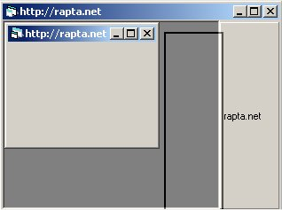



## Dockable Statusbar within MDI

### Description

Shows how to dock a statusbar control to the top-left-right-bottom of an mdi form, or make the statusbar detatch from the form and 'float'
 
### More Info
 

             |
---                |---
**Submitted On**   |2001-04-14 04:52:30
**By**             |[Dave Bushea](https://github.com/Planet-Source-Code/PSCIndex/blob/master/ByAuthor/dave-bushea.md)
**Level**          |Advanced
**User Rating**    |3.8 (19 globes from 5 users)
**Compatibility**  |VB 4\.0 \(32\-bit\), VB 5\.0, VB 6\.0
**Category**       |[Miscellaneous](https://github.com/Planet-Source-Code/PSCIndex/blob/master/ByCategory/miscellaneous__1-1.md)
**World**          |[Visual Basic](https://github.com/Planet-Source-Code/PSCIndex/blob/master/ByWorld/visual-basic.md)
**Archive File**   |[Dockable S183494142001\.zip](https://github.com/Planet-Source-Code/dave-bushea-dockable-statusbar-within-mdi__1-22393/archive/master.zip)

